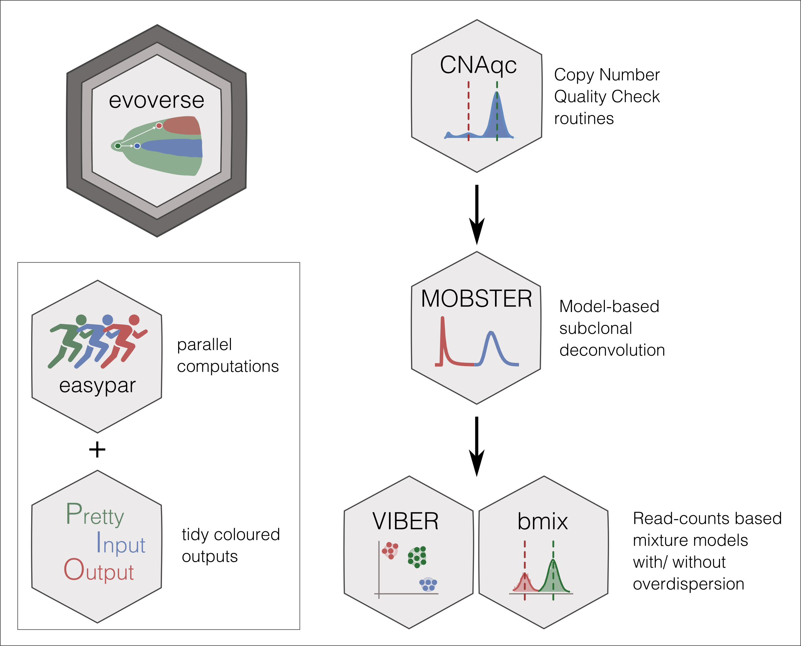

```{r, include = FALSE}
knitr::opts_chunk$set(
  collapse = TRUE,
  comment = "#>",
  fig.path = "man/figures/README-",
  out.width = "100%"
)
```
# evoverse 

<!-- badges: start -->

[](https://travis-ci.org/caravagn/evoverse)
<!-- badges: end -->

`evoverse` is a package that provides a set of functions to perform cancer evolution analyses on cancer sequencing data of multiple biopsies. This package offers a simple interface to the implementation of pipelines that seek to exploit MOBSTER, VIBER and other packages that can be used to perform multi-sample analyses.

# 

#### Other packages

The `evoverse` integrates the following packages:

-  [MOBSTER](https://caravagn.github.io/MOBSTER/), a package for tumour subclonal deconvolution which combines Dirichlet  mixtures with distributions predicted by theoretical population genetics;

-  [VIBER](https://caravagn.github.io/VIBER/), a package for tumour subclonal deconvolution that implements 
variational fits for Binomial mixtures;

- [CNAqc](https://caravagn.github.io/CNAqc/), a package that provide a set of metrics to assess the quality of 
Copy Number Alteration (CNA) calls

#### Help and support

`evoverse` has its own webpage at [GitHub pages](https://caravagn.github.io/evoverse/).


-----

### Installation

You can install the released version of `evoverse` from
[GitHub](https://github.com/) with:

``` r
# install.packages("devtools")
devtools::install_github("caravagn/evoverse")
```

-----

#### Copyright and contacts

Giulio Caravagna, PhD. _Institute of Cancer Research, London, UK_.

* Personal webpage: [https://bit.ly/2kc9E6Y](https://sites.google.com/site/giuliocaravagna/), 
* Email address: [giulio.caravagna@icr.ac.uk](mailto:giulio.caravagna@icr.ac.uk) and [gcaravagn@gmail.com](mailto:gcaravagn@gmail.com)
* Twitter feed: [@gcaravagna](https://twitter.com/gcaravagna)
* GitHub space: [caravagn](https://github.com/caravagn)

