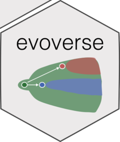

# evoverse 

<!-- badges: start -->

[](https://travis-ci.org/caravagn/evoverse)
[](https://caravagn.github.io/evoverse)

<!-- badges: end -->

The `evoverse` collects multiple R packages to implement Cancer
Evolution analyses on cancer bulk sequencing data, which can be used to
reconcile tumour heterogeneity (TH).

With the `evoverse` functions you can study TH across patients
(inter-patient heterogeneity), or within a patient (intra-tumour
heterogeneity).

#### Features

  - functions to QC somatic calls (mutation and copy number segments)
    for a Cancer Evolution analysis;

  - functions to determine subclonal architectures integrating both
    Population Genetics and Machine Learning (model based subclonal
    deconvolution);

  - determine repeated evolution across patients, comparing tumours for
    their evolutionary trajectories (repeated evolutionary
    trajectories).

[](https://caravagn.github.io/evoverse/articles/pipelines.html)
[](https://caravagn.github.io/evoverse/articles/packages.html)

#### Help and support

[](https://caravagn.github.io/evoverse)

-----

### Installation

You can install the released version of `evoverse` from
[GitHub](https://github.com/) with:

``` r
# install.packages("devtools")
devtools::install_github("caravagn/evoverse")
```

-----

#### Copyright and contacts

Giulio Caravagna, PhD. *Institute of Cancer Research, London,
UK*.

[](https://github.com/caravagn)
[](mailto:gcaravagn@gmail.com)
[](https://twitter.com/gcaravagna)
[](https://sites.google.com/site/giuliocaravagna/)
