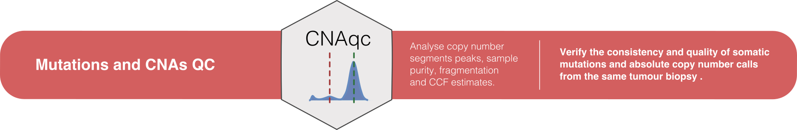

```{r, include = FALSE}
knitr::opts_chunk$set(
  collapse = TRUE,
  comment = "#>"
)
```

```{r setup, message=F, warning=F}
library(evoverse)
```

# Pipeline



**Input requirements.** 

* one [CNAqc](https://caravagn.github.io/CNAqc/) input dataset, 
  * somatic mutations  (with read counts data);
  * absolute copy number segments;
  * tumour purity.
* a list of karyotypes to time, supported ones are `c('2:0', '2:1', '2:2')` (default); 
* pipeline parameters.

**Pipeline skeletons.**

1. map mutations to copy number segments, with [CNAqc](https://caravagn.github.io/CNAqc/);
2. subset mutations according to the input list of karyotypes;
3. perform [MOBSTER](https://caravagn.github.io/mobster/) deconvolution from raw VAF data:
   * attempt a first run using the ellipsis parameters;
   * use the timing classifier of `evoverse` to determine QC PASS/ FAIL status per karyotype;
   * attempt a second run with karyotyepes that fail QC, using `mobster`'s default parameters;
   * re-assess QC for the re-run cases.
* create output summary and assignments tables.

# Example run

Example input data from the example CNAqc dataset

```{r, cache=TRUE, eval=TRUE}
# Use example data in the CNAqc package
data(example_dataset_CNAqc, package = 'CNAqc')

pipeline = pipeline_qc_copynumbercalls(
  mutations = CNAqc::example_dataset_CNAqc$snvs,  # Somatic mutations
  cna = CNAqc::example_dataset_CNAqc$cna,         # Copy number segments
  purity = CNAqc::example_dataset_CNAqc$purity,   # Sample purity
  reference = 'GRCh38',                           # Genome reference
  description = "Example  dataset for QC",       # Dataset description
  smooth = TRUE,                                  # Smooth copy number segments
  matching_epsilon_peaks = 0.025,                 # Peak-detection parameters
  CCF_computation = 'ENTROPY'                     # CCF computation
  )
```

S3 output object
```{r, eval=TRUE}
print(pipeline)
```

Output fields
```{r, eval=TRUE}
# CNAqc object
print(pipeline$fit)

# Summary QC
print(pipeline$QC)
```

One-page plotting function (assembles a multi-panel figure)
```{r, fig.width=15, fig.height=6, eval=TRUE}
```
